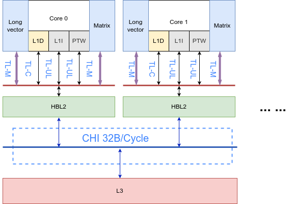
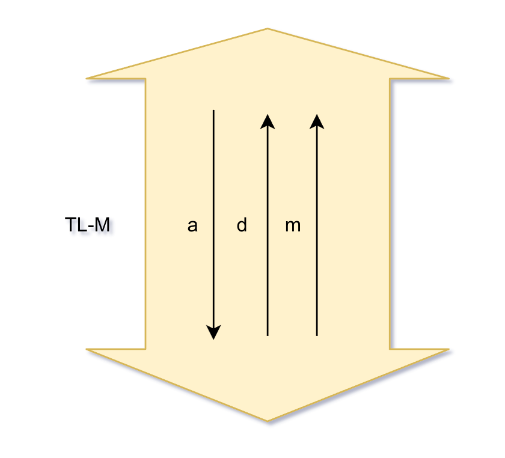
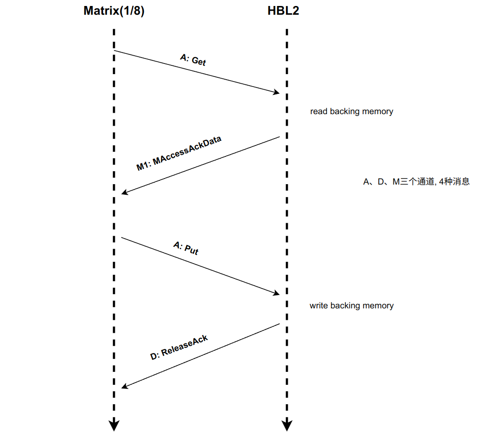
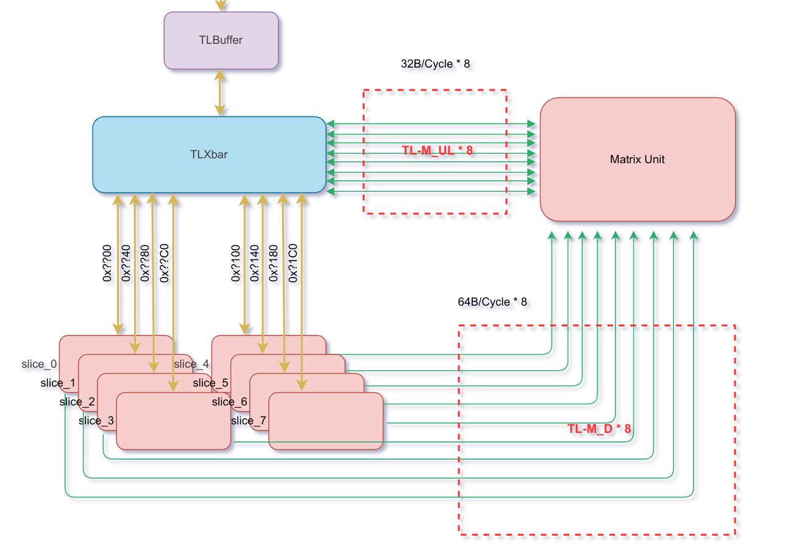
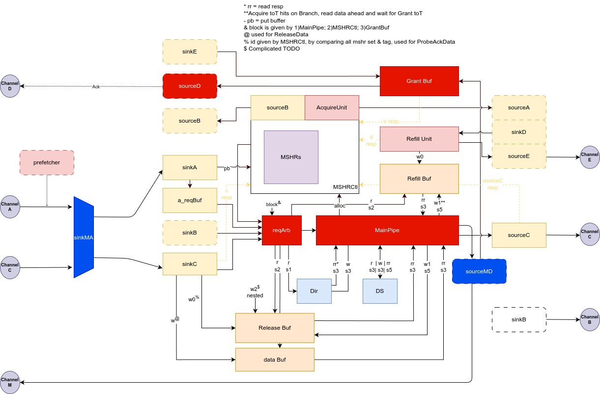
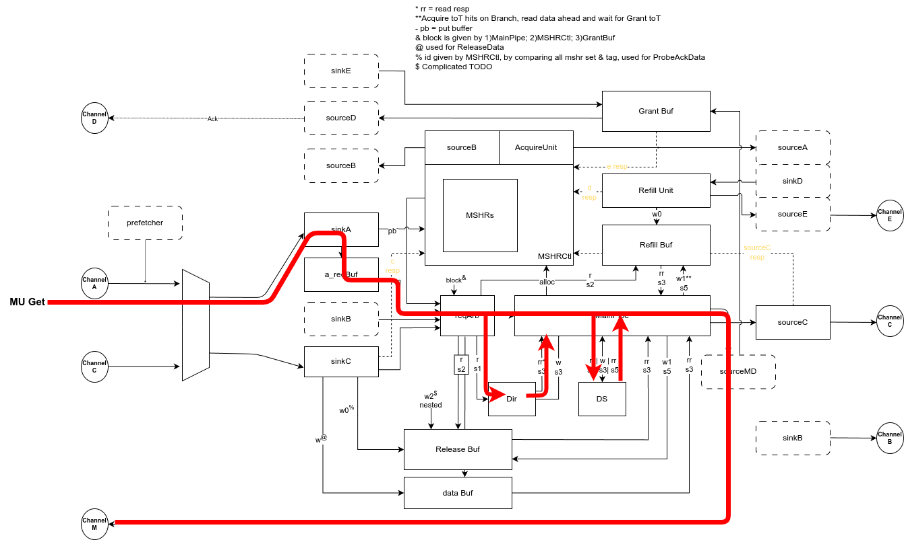
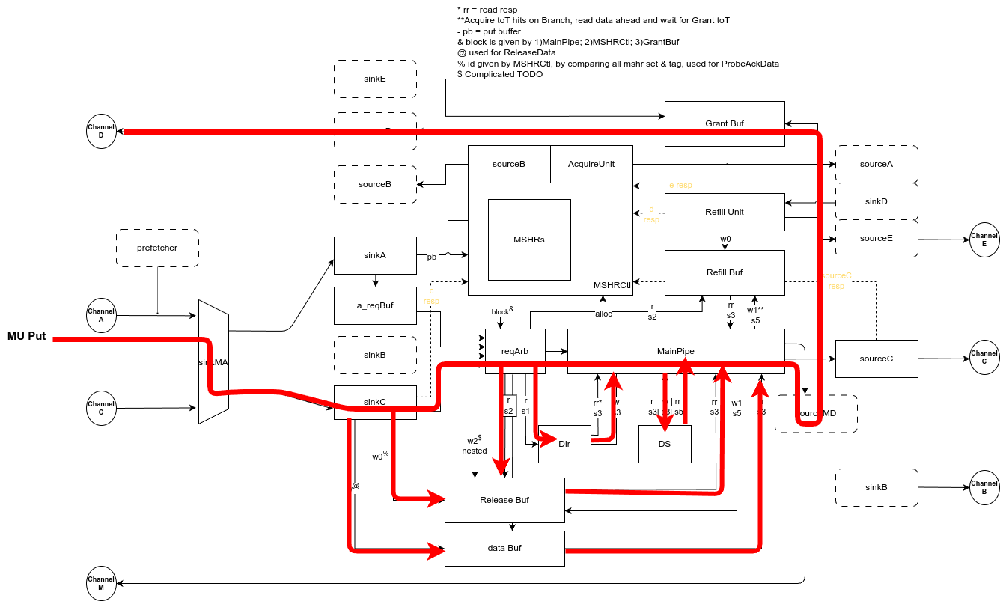

# High-bandwidth L2 cache 设计文档草案 v1

- **文档版本**：1.0
- **作者**：乐国春
- **日期**：2025/03/12

## 设计框架

HBL2 需要提供 128-512 Byte/cycle 的带宽，2byte\*16\*16 load per cycle，使得 GEMM 吞吐达到 8TFLOPS @ 2GHz (fp16).
香山现有的CoupledL2的最大带宽小于32B/Cycle, 为了支持最大512B/Cycle的读带宽, 需要将开源的 CoupledL2 cache 改造为 High-bandwidth L2 cache.

### HBCoupledL2：
- 1MB容量，8路组相连，分为8个Bank
- 缓存块Block大小为 64 Bytes，ABCDE总线数据位宽 256 bit = 32 Bytes，所以每次传输包含64/32 = 2个beat, M总线数据位宽512Bit, 一次传输完成.
- 采用基于目录的TileLink缓存一致性协议
- 包含策略为全包含（Inclusive）
- 采用主流水线架构
- 16个MSHR，其中15个为AB请求通用，1个为B请求专用
- 支持同set请求的并行访问（去除set阻塞）
- 支持在收到重填数据时再进行替换路的选择和释放
- 支持访存请求和预取请求的融合
- 支持产生Hint信号提前唤醒load指令
- 支持BOP预取器、Temporal预取器、接收来自L1的预取（receiver）

### 基本拓扑结构

  

即新增TL-M总线协议, 连接MU与L2.

该协议基于TL-UL协议修改(下图中a、d通道), 并增加了m通道:

  

具体的, Channel A, 用以发送Get(请求数据)、Put(写回数据)请求.
Channel D, 用以HBL2回复MU Put请求的已接收ReleaseAck.
Channel M, 用以HBL2回复Get到的数据MAccessAckData.
如图展示一次读写流程.

  

为了支持更大的带宽, 我们将CoupledL2的bank数(Slice数)增大到8个.

为了方便描述, 本文档将基于TL—UL协议修改的部分(TL_M中的A、D通道), 称为TL-M_UL, 新增的M数据通道称为TL-M_D.

当前设计中, 写(Put)带宽为256B/Cycle, 读(Get)带宽为512B/Cycle.

## 微结构设计

### Slice

每个Slice包含完整的TileLink A、B、C、D、E通道(数据位32Byte), 以及专为MU读数据的M通道(数据位64Byte).每个Slice 的M通道与MU直连.

### 模块划分

p: 文档中, 我们假定写某一地址一定是有效的, 不会抛出错误.

#### SinkMA

SinkMA接收来自A、C通道的总线请求

- 当A通道请求为Get、并且user字段中MatrixKey有效时, 认定这是一次来自MU的读数据请求. 该请求直接发往SinkA转为Slice内部事务, 并且对该事务标记Matrix.
- 当A通道请求为Put、并且user字段中MatrixKey有效时,认定这是一次来自MU的写数据请求. SinkMA会改变该请求的Opcode为ReleaseData. 同时发往SinkC.

当且仅当A通道下游Ready时且C通道上游Ready时, A通道上游Ready拉高, 表示准备接收A通道数据.
即: 当前Slice正接收来自C通道的请求时, 会拒绝接收A通道的请求, 以避免A通道Put请求打断DCahce C通道的正在进行的ReleaseData.

#### SinkMD

SinkMD接收来自MainPipe的task. 并选择发往MU或者GrantBuf.
我们总是假定MU是Ready有效的.

- 当task是一次matrixTask时, 发送数据以及sourceId到MU.
- 否则正常进入GrantBuf.

#### 其他

- SinkA 和 SinkC 接收来自 L1 的 Acquire、Get、Release、ProbeAck
- ReqBuffer 负责暂存被阻塞住的 Acquire、Get 和 L2 预取请求，同时负责
  - Acquire 与 late prefetch 的合并
  - 请求 flow（不经过 ReqBuffer 直接进入流水线）
  - 预取请求去重
  - 如果请求被某项 MSHR 阻塞，reqBuffer 负责在 MSHR 释放时唤醒该请求
  - 流控：由于 main pipe 是非阻塞的，所以 req buffer
- SourceB 向 L1 发送 rProbe/pProbe
- GrantBuffer 向 L1 返回 Grant[Data]，直到接收到 E 通道的 GrantAck 即可释放

ReqArb 负责仲裁来自各个通道的请求，同时访问目录，并把请求发往 MainPipe.
流水级划分如下：
- s0
  - 接收 MSHR 请求
- s1
  - 从 MSHR task 和 SinkA / SinkC / RXSNP 请求中做四选一仲裁
  - 读目录
- s2
  - 读 refill buffer / release buffer
- s3
  - 得到读目录的结果
  - 得到 refill buffer 和 release buffer 返回的数据
  - 如果是 SinkA / RXSNP 请求，且需要其他 transaction 辅助完成请求，则在 s3 分配 mshr，同时设置好 mshr 状态机
  - 写目录
    - SinkC 请求直接写目录
    - SinkA / RXSNP 请求如果不需要其他 transaction 辅助完成请求，则直接在 s3 写目录
    - mshr 请求按照 mshr 设置好的 metaWen 和 meta 来写目录
  - 写 tag
  - 写或读 DS
  - 如果是 SinkA 的请求，还需要训练预取器
  - 如果后续没有其他操作（比如等待 DS 返回数据），且 s4/s5 没有请求要离开流水线，即可在 s3 离开流水线
- s4
  - 如果 s5 没有请求要离开流水线，即可在 s4 离开流水线
- s5
  - 得到读 DS 的结果
  - 写 release buf
  - 离开流水线

### 请求处理流程

#### Get

Hit的情况下, 一次来自MU的对地址0xfffff1C0的Get请求, 将会发往Slice7处理
Get 请求进入 MainPipe 并读目录, 假定命中且权限够，则直接更新目录，读 DS，然后进入 sourceMD，向 MU 返回 64B的data以及对应的sourceID，然后 transaction 结束.

#### Put

来自MU的Put请求, 将在sinkMA转化为ReleaseData请求. 走正常的Release数据通路.

