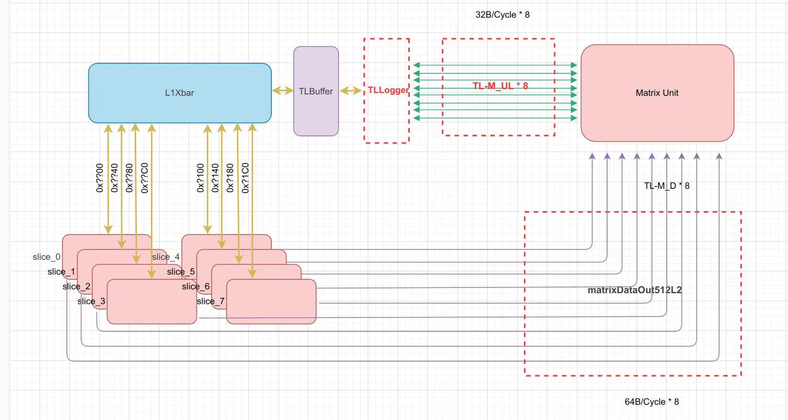

# 接口说明(HBL2与AMU集成)草案v0.1

## 项目概述

该集成旨在将两个模块——L2Cache和AMU——连接起来。L2负责处理上下游的存取操作；AMU负责处理矩阵计算。在本设计中，AMU将通过L2Cache执行数据的Get/Put操作，实现数据存取。

## 环境准备

以下L2代指HBL2(https://github.com/OpenXiangShan/CoupledL2/tree/matrix-test)

```bash
git clone -b matrix-test https://github.com/OpenXiangShan/CoupledL2.git
git pull
```

具体参考`CoupledL2/src/test/scala/TestTopAME.scala`

实际集成过程就是在AMU中建立8个ul TLClientNode和8个MatrixDataBundle与HBL2连接。集成中，主要修改AMU类的定义和AMU仿真(TestTop)。



## 接口定义

### M通道

| Name | Width | Description |
|------|-------|-------------|
| matrixDataOut512L2 | l2_banks*(sourceId_width+DSBlock_width+rdy+valid) | 在l2_banks为8的情况下, matrixDataOut512L2[0]对应上图中的第一条TL-M_D. 每条TL-M_D通道包含{ready, valid, sourceID, data}, 对应的类型为MatrixDataBundle |

### A通道bits

| 字段 | 定义 | 说明 |
|------|------|------|
| Opcode::Get | object freechips.rocketchip.tilelink.TLMessages定义 | 请求数据 |
| Opcode::PutFullData | object freechips.rocketchip.tilelink.TLMessages定义 | 写回数据 |
| user(MatrixKey) | - | 设置为1, 则表示标记该请求为Matrix请求 |
| data | 64Byte | 写回数据 |
| mask | - | - |
| size | - | - |

### D通道bits

| 字段 | 定义 | 说明 |
|------|------|------|
| Opcode::ReleaseACK | - | D通道回复写回数据成功 |

## 接口连接概述

本设计使用TileLink协议进行通信。在L2Cache和Matrix单元之间，我们使用TileLink客户端和主机节点来建立连接。通过设计两个模块之间的TileLink接口，Matrix单元能够通过L2Cache执行数据请求操作。

## 硬件接口连接

### HBL2实例化

#### build.sc构建配置

配置类似, 否则会出现import coupledL2问题：

```scala
object coupledL2 extends $file.coupledL2.common.CoupledL2Module with HasChisel {
  override def millSourcePath = pwd / "coupledL2"// coupledL2源码的位置
  def rocketModule: ScalaModule = rocketchip
  def utilityModule: ScalaModule = utility
  def huancunModule: ScalaModule = huancun
}

object AMU extends SbtModule with HasChisel with millbuild.common.AMUModule {
  override def millSourcePath = millOuterCtx.millSourcePath
  def coupledL2Module: ScalaModule = coupledL2

  object test extends SbtModuleTests with TestModule.ScalaTest {
    override def ivyDeps = super.ivyDeps() ++ Agg(
      getVersion("chiseltest"),
    )
  }
}
```

#### 必要的导入包

```scala
import freechips.rocketchip.tilelink._
import coupledL2.{EnableCHI, L2ParamKey, PrefetchCtrlFromCore}
import coupledL2.tl2tl.TL2TLCoupledL2
import coupledL2.tl2chi.{CHIIssue, PortIO, TL2CHICoupledL2}
import huancun.BankBitsKey
```

#### HBL2实例化示例

```scala
val hbl2 = LazyModule(new TL2TLCoupledL2()(baseConfig(1).alter((site, here, up) => {
    case L2ParamKey => L2Param(
      name = s"hbl2",
      ways = 8,
      sets = 512,
      channelBytes = TLChannelBeatBytes(32),
      blockBytes = 64,
      clientCaches = Seq(L1Param(aliasBitsOpt = Some(2), vaddrBitsOpt = Some(16))),
      echoField = Seq(DirtyField()),
    )
    case BankBitsKey => log2Ceil(l2_banks)
    // ... //L2的配置, 参见CoupledL2/src/test/scala/TestTopAME.scala
})))
```

### TL-M_UL连接

该通道负责发起Get、Put请求。

#### AMU LazyModule定义示例

```scala
// 生成8个ul TLClientNode
val matrix_nodes = (0 until 1).flatMap { i =>
  (0 until 8).map { j =>
    TLClientNode(Seq(
      TLMasterPortParameters.v1(
        clients = Seq(TLMasterParameters.v1(
          name = s"matrix${i}_${j}",
          sourceId = IdRange(0, 32)
        )),
        requestFields = Seq(MatrixField(2))
      )
    ))
  }
}
```

#### 完整AMU示例代码

```scala
class AMUIO(implicit p: Parameters) extends Bundle {
  val matrix_data_in = Vec(8, DecoupledIO(new MatrixDataBundle()))  // 用于输出数据
}

class AMU(implicit p: Parameters) extends LazyModule {
  val matrix_nodes = (0 until 1).flatMap { i =>
    (0 until 8).map { j =>
      TLClientNode(Seq(
        TLMasterPortParameters.v1(
          clients = Seq(TLMasterParameters.v1(
            name = s"matrix${i}_${j}",
            sourceId = IdRange(0, 32)
          ))
        )
      ))
    }
  }

  lazy val module: AMUImp = new AMUImp(this)
}

class AMUImp(outer: AMU) extends LazyModuleImp(outer) {
  val io: AMUIO = IO(new AMUIO)
  private val matrix_data_in = io.matrix_data_in

  outer.matrix_nodes.zipWithIndex.foreach { case (matrix_node, i) =>
    val (bus, edge) = matrix_node.out.head
    bus.a.bits.address := 0xff_ffff.U
    bus.a.bits.opcode := TLMessages.Get  // 示例请求数据
    bus.a.bits.user(MatrixKey) := 1.U
    bus.a.bits.data := 0x267127.U
  }
}
```

#### 连接到xbar

```scala
// 连接到amu的matrix_nodes l1xbar上
val l1xbar = TLXbar()
amu.matrix_nodes.zipWithIndex map { case(m,i) =>
  l1xbar := TLBuffer() := TLLogger(s"L2_Matrix[${i}]", true) := m
}

// 连接到l2上
val l2bankBinders = BankBinder(l2_banks, 64)
l2bankBinders :*= hbl2.node :*= TLBuffer() :*= l1xbar
```

参考：AMU如何使用定义matrix_nodes可参考 https://github.com/OpenXiangShan/XiangShan/blob/57a8ca5e38b9245f78623b83e7b009df606585fb/src/main/scala/xiangshan/frontend/icache/InstrUncache.scala#L161

### TL-M_D连接

AMU接收数据：
```scala
amu.io.matrix_data_in <> hbl2.module.io.matrixDataOut512L2
```

## 配置与参数说明

### L2Cache配置

- ways: 设置L2Cache的组数，本设计中为8
- sets: 设置L2Cache的集合数，本设计中为512
- channelBytes: 设定每个数据通道的字节数，本设计中为64字节
- blockBytes: 设置L2Cache块的字节数，本设计中为128字节
- enableTagECC：设置是否启用标签错误检测和纠正，本设计中禁用
- m_num: 设定Matrix单元的数量。默认为8
- l2_banks: 设置L2Cache中bank的数量，决定L2Cache的并行性。默认为8
- l3_banks: 设置L3Cache中bank的数量。默认为4

## 常见问题与解决方案

### 1. Matrix单元无法成功读取数据

解决方案：确认Matrix单元发送的matrix_node节点的请求是否符合要求，并确保L2Cache模块正确响应请求。检查matrixDataOut512L2接口的连接是否正常。