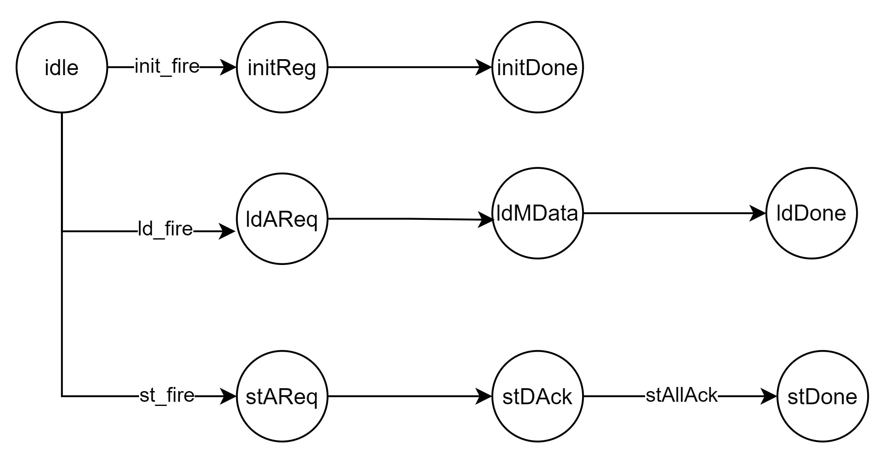
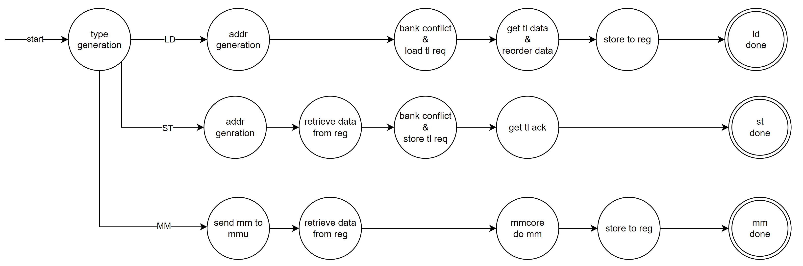

# HBL2 AMU Demo

A Simple AMU using HBL2 as package.

Initialization:

```BASH
git clone git@github.com:LeleCheung/HBL2-AMU-Demo.git  
cd HBL2-AMU-Demo
git submodule update --init --recursive
```

Chisel Test (test_run_dir/):
```BASH
make test-top
```

Generate Verilog (build/):
```BASH
make gen-top
```

Clean:
```BASH
make clean
```


SIMPLE TEST:

- Init the register
- Store the data back to HBL2
- Load the data from HBL2
- Check the register value


## AMU v0: No Computing Core, only test for LD/ST.



## AMU v1: Add Computing Core, test for LD/ST and MMA.


